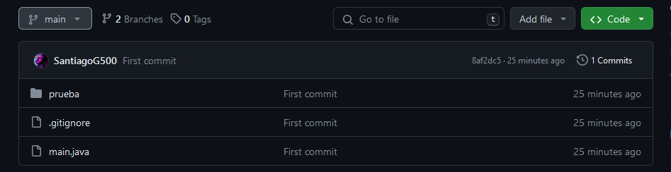
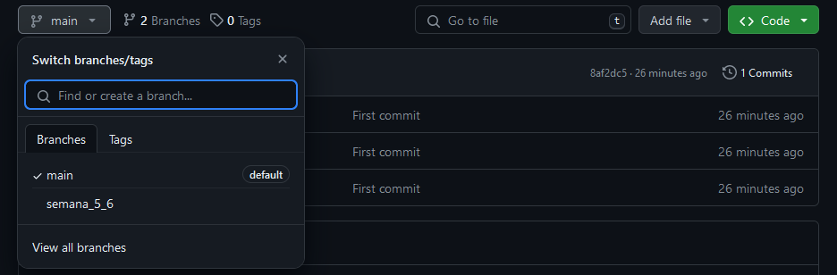

# Ejercicios de Programación

Repositorio de Ejercicios hechos en Java para la asignatura de Programación II, grupo 301 de la Universidad de Cundinamarca.

Los ejercicios (a partir de la semana 5 y 6) se encuentran separados en su rama específica. Para cambiar de rama, haz clic en el menú desplegable a la izquierda. Por defecto está en la rama main, donde encontrarás todas las semanas separadas por una rama.

  